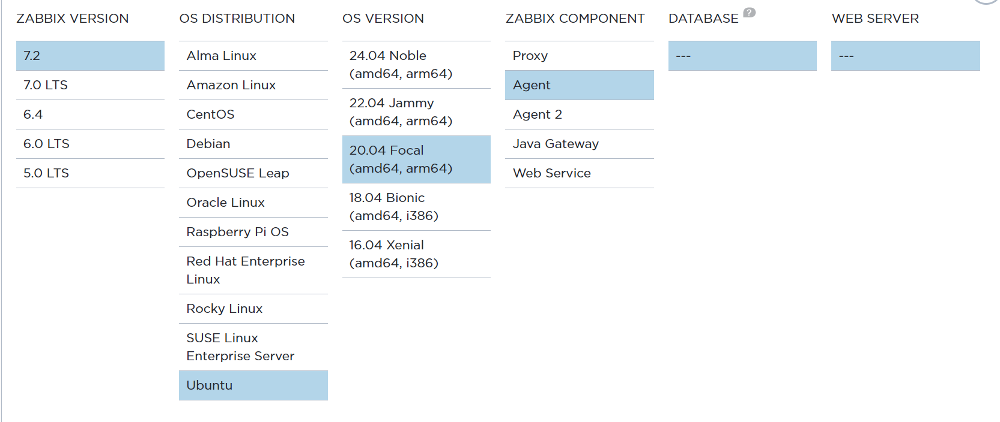
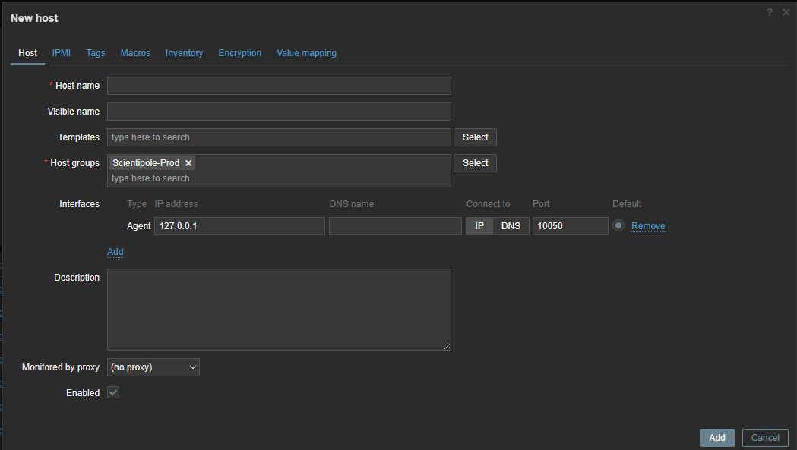

# Install and Configure Zabbix Agent


## Getting started

Zabbix is an open-source monitoring tool for tracking the performance and availability of IT systems. This documentation explains how to install, configure, and add a Zabbix Agent to the dashboard for efficient system monitoring.

## Install the Zabbix Agent

### Add the Zabbix repository:
Choose from the list based on your system's version:
[link](https://www.zabbix.com/download?zabbix=7.2&os_distribution=ubuntu&os_version=20.04&components=agent&db=&ws=)

In this case, we are using Ubuntu 20.04.



```bash
# wget https://repo.zabbix.com/zabbix/7.2/release/ubuntu/pool/main/z/zabbix-release/zabbix-release_latest_7.2+ubuntu20.04_all.deb

# dpkg -i zabbix-release_latest_7.2+ubuntu20.04_all.deb

# apt update
```

### Install the Zabbix Agent

```bash
# apt install zabbix-agent
```

## Configure the Zabbix Agent

### Open the configuration file:
```bash
# nano /etc/zabbix/zabbix_agentd.conf
```

### Update the following parameters
- Server: Enter the IP address or hostname of your **Zabbix Server**
```bash
Server=10.4.1.33
```
- ServerActive:  Add the **Zabbix Server** IP for active checks
```bash
ServerActive=10.4.1.33
```
- Port: Specify the port for the Zabbix Agent to listen on. Default is 10050. Change it only if needed.
```bash
ListenPort=10050
```

## Start and Enable the Zabbix Agent

### Start the Zabbix Agent
```bash
# systemctl start zabbix-agent
```

### Enable the Zabbix Agent
```bash
# systemctl enable zabbix-agent
```

### Check the status of the agent
```bash
# systemctl status zabbix-agent
```


## Add the Host to the Zabbix Dashboard
### Log in to the Zabbix Web Interface
[Monitoring Dashbord](https://monitoring.proxym-group.net/zabbix.php?action=dashboard.view)
### Add a New Host:

Navigate to **Configuration** > **Hosts** > **Create Host**



Fill in the following details \
**Host Name:** Enter the hostname \
**Groups:**  Select an appropriate group \
**Interfaces:** Ensure the Agent interface is configured with the client's IP address and Port.

### Link a Template:

Under the Templates section, click Add.\
Select a relevant template group (e.g., "Templates") and then choose the template (e.g., "Linux by Zabbix agent").

### Save the Host:

Click Add to save the new host.

## Verify the Setup
Go to **Monitoring** > **Hosts** in the Zabbix Dashboard.\
Check if the new host appears and its availability status shows as
 $\textsf{\color{#008000} {Green}}$ 

#

 With these steps, you should have successfully installed, configured the Zabbix Agent, and added it to the Zabbix Dashboard for monitoring. 
